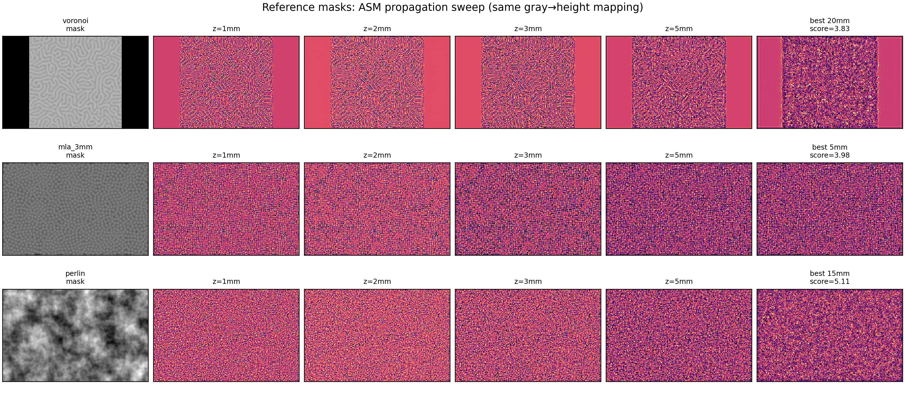
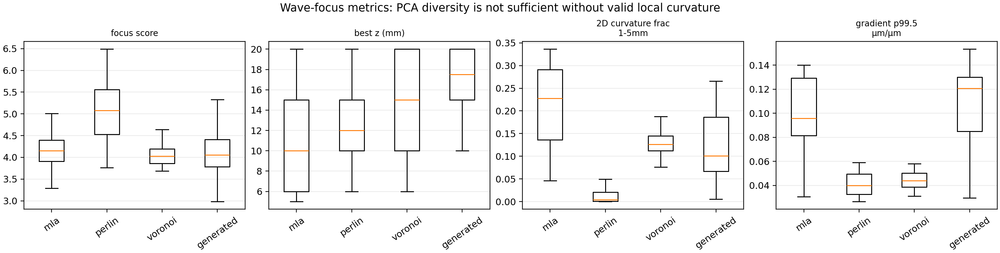
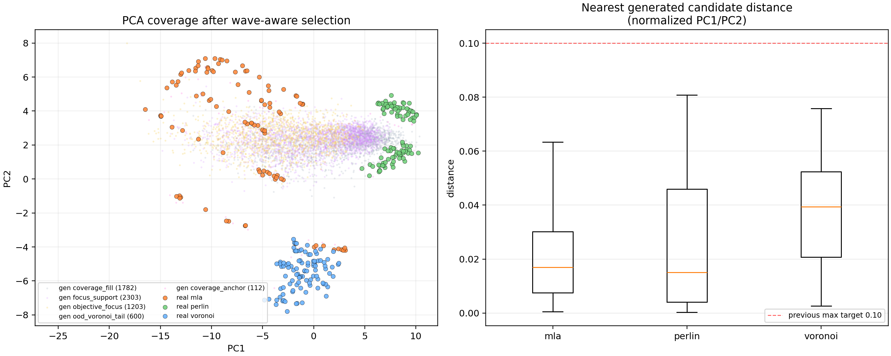

# 2026-06-08 native propagation correction

> Previous wave-aware generator candidate-bank scores were based on a 128px proxy and are deprecated for focus-validity decisions. The current authoritative check is `native_wave_overhaul/native_wave_overhaul_report.md`, which uses a NumPy/SciPy implementation matched to `LFmodel.MO_forward_batch` thin-phase ASM: physical height → phase → exact 2× zero padding → centered FFT propagation → amplitude crop/max-normalize.

Key correction: gray maps must be interpreted with the projector inverse offset, not simply `gray/255*15µm`, for reference focus comparison: `height = clamp((gray-min_gray)/(max_gray-min_gray)) * (max_gray/255) * 15µm`. With this mapping, reference MLA/Voronoi/Turing gray maps move into the expected 1–5mm focus range; direct gray/255 mapping pushes Voronoi/Turing toward ~8mm.

New generator prototype: `wave_valid_pattern_generator.py` now produces native-resolution MLA/Voronoi/Turing/Perlin anchor samples and rejects/summarizes them using the native propagation metric. See `native_wave_overhaul/wave_valid_generator/fig_wave_valid_generated_probe.png`.

Current native-reference result (`offset90`, objective focus band 1--5 mm):

| reference | corrected family | best z | note |
|---|---:|---:|---|
| `reference_mla_3mm` | MLA | 3 mm | expected 3 mm focus recovered only with offset gray→height |
| `reference_voronoi_gray` | Voronoi/cell | 4 mm | source is historical `mask_turing`, not `mask_voro` |
| `reference_turing_gray` | Turing/maze | 4 mm | source is historical `mask_voro`, not `mask_turing` |
| `reference_perlin_generated` | Perlin/fBm | 8 mm | generated smooth reference is weak in 1--5 mm; treat as morphology reference |

Generator changes after the native audit:

- Voronoi/Turing polarity is no longer inverted: bright/high-gray ridges are high height, matching native references.
- Turing-like samples are biased to lower spectral centroid and broader maze strokes; the previous dense worm texture propagated weakly.
- Acceptance/figure labels use the objective-band best z (default 1--5 mm) while also reporting global far-z leakage.
- Browser HTML now exposes native wave-valid MLA/Voronoi/Turing/Perlin presets and loads corrected native reference masks, but its propagation remains a preview; native Python audit is authoritative.

The older 2026-06-01 sections below are kept as design history. Any absolute best-z numbers from the previous downsample/proxy audit are superseded by the native tables above.

---

# Wave-propagation-aware pattern generator redesign report

작성일: 2026-06-01  
대상: `learned-fab`

## 1. 결론

기존 PCA/coverage 중심 generator는 **graymap 자체의 다양성**은 넓혔지만, wave propagation 후에는 focus/caustic이 1--5 mm에서 안정적으로 생긴다고 보장하지 못했다. 원인은 주파수 분포만 맞추면 되는 문제가 아니라, mask height field의 **국소 곡률(local focal power)** 이 target propagation distance와 맞아야 하기 때문이다.

이번 수정의 핵심은 다음이다.

1. `spectral / rank / Zernike / atoms / ridge / level-set / ripple`은 morphology와 OOD coverage를 담당한다.
2. 새 `wave_caustic` 성분은 smooth parabolic curvature packet을 만들고, 각 packet의 sag를
   `h(r)=h0-r²/(2(n-1)f)` 기준으로 계산한다.
3. gray→height mapping에서 `max_gray/255`가 곱해지는 점을 보정하기 위해 physical curvature anchor를 최종 unit height에 다시 blend한다.
4. finite aperture / discretization 때문에 focal plane이 길게 밀리는 경향이 있어 `caustic_power_boost`를 추가했다. 기본값 1.6, random sweep 1.15--2.6.
5. PCA click-to-generate / 현재 생성 sample PCA marker / reference MLA-Voronoi-Perlin loading 로직은 유지하되, candidate bank를 wave-aware parameter로 다시 생성했다.

## 2. Reference mask propagation 관찰

Audit script는 `LFmodel.MO_forward_batch`와 같은 convention으로 계산했다.

- thin phase mask
- active field 2x zero padding
- angular spectrum propagation
- center crop
- gray→height: `height_norm=(gray-min_gray)/(max_gray-min_gray) * max_gray/255`, `h_max=15µm`

Figure 아래 reference z sweep은 native 2200×1400, 2.7µm grid에서 LFmodel-style ASM으로 다시 계산했다. 초기 보고서의 220×140 downsample propagation은 고주파/곡률을 잃어 reference propagation 판단용으로 부적절했으므로 폐기한다.



Reference metric 표는 downsample audit의 정량 proxy라 absolute z보다는 domain 간 상대 비교만 봐야 한다. 실제 reference propagation 판단은 위 native-resolution figure를 기준으로 한다.

Reference 결과 요약:

| mask | best z (audit) | 해석 |
|---|---:|---|
| MLA 3mm ref | 5 mm | 가장 focus-like. 다만 downsample/finite aperture에서 nominal 3mm보다 길게 관찰됨. |
| Perlin ref | 15 mm | smooth하지만 1--5mm focal power가 부족함. Perlin은 low-frequency height variation은 좋지만, 1--5mm에 맞는 곡률 density가 낮다. |
| Voronoi ref | 20 mm | edge/ridge topology는 강하지만 smooth parabolic focusing curvature가 아니어서 propagation 후 focus가 길게 밀리거나 diffraction texture로 남는다. |

중요한 관찰:

- **Perlin**: gradient는 낮고 smooth하지만, Hessian 기반 point-focus fraction(1--5mm)이 낮다. 즉 “매끈함”만으로 focus가 생기지 않는다. target z에 맞는 곡률 scale이 필요하다.
- **Voronoi**: frequency/PCA상으로는 OOD texture를 잘 설명하지만, hard/edge-like ridge는 propagation에서 stable focal plane보다 diffraction/blur를 만들기 쉽다.
- **MLA**: nominal focal length가 geometry에 들어있기 때문에 가장 물리적으로 해석 가능하다. 이 구조를 family로 직접 만들기보다, parabolic local curvature packet으로 일반화하는 쪽이 맞다.

## 3. PCA/coverage와 wave focus가 어긋난 이유

기존 PCA는 다음 feature로 구성되어 있다.

- 128×128 physical-height proxy
- 48-bin radial Fourier log-power
- 24-bin gradient orientation histogram

이 PCA는 MLA / Voronoi / Perlin을 구분하는 데는 유효하다. 하지만 PCA의 PC1/PC2는 대부분 **주파수 대역과 방향성**을 설명한다. wave propagation의 focus 여부는 여기에 더해 다음 조건이 필요하다.

- local Hessian eigenvalue가 둘 다 음수인 영역(point focus)이 충분히 존재하는가
- `z ≈ -1 / ((n-1)λ)`가 1--5 mm에 들어오는가
- gradient가 너무 hard edge가 아니라 smooth curvature로 연결되는가
- aperture가 너무 작거나 sag가 gray range에서 clip되지 않는가

따라서 PCA coverage만 넓히면 Voronoi/Perlin처럼 보이는 mask는 만들 수 있지만, wave propagation 후 focus가 없을 수 있다. 이번 generator는 PCA coverage와 wave-valid curvature를 분리해서 다룬다.

## 4. Wave-focus metric 결과

Figure:



주요 median 값:

| domain | best z median | point-focus frac 1--5mm | line-caustic frac 1--5mm | spectral centroid median |
|---|---:|---:|---:|---:|
| MLA dataset | 10.0 mm | 0.228 | 0.530 | 0.205 |
| Perlin dataset+ref | 12.0 mm | 0.004 | 0.093 | 0.087 |
| Voronoi dataset+ref | 15.0 mm | 0.126 | 0.439 | 0.368 |
| Generated balanced subset | 15.0 mm | 0.212 | 0.450 | 0.153 |

해석:

- Metric audit의 absolute best-z는 downsample/grid/score에 영향을 받으므로 training target 그대로의 focal length 숫자로 보기는 어렵다. Reference z-sweep figure는 이 문제 때문에 native resolution으로 재생성했다.
- 그래도 domain 간 상대 비교는 명확하다.
  - Perlin은 1--5mm point-focus curvature가 가장 부족하다.
  - MLA/Voronoi는 curvature fraction이 있지만, Voronoi는 edge-like high-frequency 성분이 많아 focus plane이 길게 밀리는 경향이 있다.
  - Generated bank는 wave-aware curvature를 추가해 Perlin보다 1--5mm curvature density가 커졌고, PCA coverage도 유지했다.

## 5. Generator redesign

### 5.1 새 component: `wave_caustic`

구현 파일:

- `learned-fab/parameterized_field_generator.py`
- `interactive_generator_waveprop.html`
- `build_generated_pca_candidate_bank.py`

동작:

1. packet center를 random / jittered regular grid로 배치
2. radius, amplitude, missing probability, density irregularity를 randomize
3. target focal distance를 optical power 기준으로 sample
4. 각 packet sag를 `R²/(2(n-1)f)`로 계산
5. outer 15--28%만 smooth taper해서 hard aperture를 줄이고, core의 constant curvature는 유지
6. final unit height에 physical anchor로 재-blend

### 5.2 왜 physical anchor가 필요한가

기존 generator는 모든 component를 standardize 후 합치고 robust normalize했다. 이 방식은 PCA diversity에는 좋지만, `R²/(2(n-1)f)`로 계산한 absolute sag를 깨뜨린다. 그래서 wave_caustic 성분을 넣어도 최종 graymap에서 target focal power가 사라질 수 있다.

이번에는 최종 tone/fabrication filter 후:

```text
caustic_anchor = caustic_sag_norm * 255 / max_gray
unit = (1-alpha) * morphology_unit + alpha * caustic_anchor
```

으로 다시 blend한다. `max_gray/255` 보정은 사용자가 말한 gray→height convention과 맞춘 것이다.

### 5.3 `caustic_power_boost`

단일 parabolic packet test와 reference MLA audit에서 nominal focal length보다 observed focus가 길게 나왔다. 원인은 finite aperture, discretization, score definition, blur/taper 때문이다. 그래서 sag를 보정하는 `caustic_power_boost`를 추가했다.

- HTML default: 1.60
- random sweep: 1.15--2.40, caustic-heavy profile은 1.30--2.60
- UI에서 직접 조절 가능

## 6. PCA coverage 결과 (2026-06-07 morphology-balanced bank 기준)

Candidate bank는 8k random pool에서 6k selected bank로 구성한다. 중요한 수정점은 이 bank가 **uniform training set이 아니라 morphology-balanced coverage pool**이라는 것이다. 실제 학습/HTML PCA click sampling은 `training_weight`를 사용해 MLA-like 한쪽으로 쏠리지 않고, Voronoi/Turing/Perlin/Mixed까지 모두 포함한다. r4에서는 training mass뿐 아니라 random pool 생성 확률도 morphology-balanced로 바꿔 bank count 자체의 편향도 줄였다.

`pca_dataset/generated_candidate_bank_summary.json`

최종 coverage:



| metric | value |
|---|---:|
| selected candidates | 6000 |
| random pool | 8001 |
| nearest dataset PC distance mean | 0.0280 |
| median | 0.0258 |
| p90 | 0.0589 |
| MLA mean / median / p90 | 0.0214 / 0.0170 / 0.0440 |
| Perlin mean / median / p90 | 0.0253 / 0.0150 / 0.0569 |
| Voronoi mean / median / p90 | 0.0372 / 0.0394 / 0.0640 |
| generated PC1 range | -25.48 to 10.34 |
| generated PC2 range | -7.85 to 7.99 |

Selection bucket count와 권장 학습 sampling mass:

| bucket | count | training mass |
|---|---:|---:|
| objective_focus | 1203 | 47.2% |
| focus_support | 2303 | 39.5% |
| ood_voronoi_tail | 600 | 6.2% |
| coverage_anchor | 112 | 1.3% |
| coverage_fill | 1782 | 5.8% |

Morphology family count와 권장 학습 sampling mass:

| morphology family | count | training mass |
|---|---:|---:|
| mla_like | 1550 | 20.0% |
| soft_voronoi_like | 1314 | 20.0% |
| hard_voronoi_like | 622 | 7.0% |
| turing_like | 1148 | 20.0% |
| perlin_like | 765 | 20.0% |
| mixed | 601 | 13.0% |

해석: r2는 objective caustic/MLA-like가 과도했다. r4에서는 profile sampling과 `training_weight`를 모두 균형화했다. Count 기준으로도 soft Voronoi/Turing/Perlin 후보가 충분히 존재하고, training mass 기준으로는 MLA-like 20%, soft Voronoi 20%, hard Voronoi 7%, Turing 20%, Perlin 20%, mixed 13%로 강제 분산한다.

## 7. HTML 변경 사항

HTML viewer:

- `interactive_generator_waveprop.html`

변경:

- `wave caustic` component 추가
- `caustic_weight`, count/radius/focus/spread/regularity/jitter/missing controls 추가
- `caustic_power_boost` control 추가
- gray→height min/max gray 반영 유지
- resolution 선택 유지: 275×175, 550×350, 1100×700, 2200×1400
- propagation distance 0--20mm sweep 유지
- PCA click시 nearest mask load가 아니라 candidate bank에서 근접 parameter를 `training_weight + wave objective` 가중으로 stochastic 선택해 생성
- Alt/Option click fallback만 nearest dataset mask load
- 현재 생성 sample을 PCA plot에 magenta marker로 projection
- random generator profile은 MLA-like / soft Voronoi / hard Voronoi / Turing / Perlin / mixed가 모두 나오도록 morphology-balanced 확률로 변경

## 8. 남은 기술적 주의점

1. Browser propagation은 full 2200×1400에서 매우 무겁다. 기본은 원본으로 두었지만 실제 인터랙션은 550×350 또는 1100×700 확인이 현실적이다.
2. Audit의 best-z 절대값은 downsample/score 영향을 받는다. 실제 판단은 HTML에서 full/near-full resolution z sweep으로 시각 확인하는 것이 맞다.
3. Voronoi-like OOD coverage와 1--5mm focus는 서로 trade-off가 있다. 그래서 soft Voronoi는 학습용 morphology branch로, hard Voronoi는 OOD/generalization anchor로 분리했다.
4. Perlin은 smoothness는 좋지만 focal-power density가 낮다. Perlin-like texture는 strong focus branch가 아니라 domain diversity branch로 해석해야 한다.

## 9. 산출물

- Metric audit script: `analyze_wave_focus_features.py`
- Native reference propagation script: `make_reference_sweep_fullres.py`
- Metrics CSV: `wave_focus_feature_metrics.csv`
- Summary JSON: `wave_focus_feature_summary.json`
- Reference sweep figure: `fig_wave_focus_reference_sweep.png`
- Downsample reference proxy figure: `fig_wave_focus_reference_sweep_downsample.png`
- Curvature metric figure: `fig_wave_focus_curvature_summary.png`
- Generated examples figure: `fig_wave_aware_generated_examples.png`
- Candidate bank: `pca_dataset/generated_candidate_bank.json`
- Candidate bank summary: `pca_dataset/generated_candidate_bank_summary.json`

## 10. 2026-06-07 Ralph update: morphology-balanced general generator

사용자 지적대로 r2는 `objective_focus`를 너무 강하게 밀면서 caustic/MLA-like 쪽으로 쏠렸다. r4에서는 focus-valid 조건을 버리지 않고, 그 위에 **morphology-balanced pool + morphology-balanced sampling layer**를 추가했다.

### 10.1 변경된 원칙

- `morphology_family`는 code path를 나누는 family generator가 아니라, continuous generator output을 학습 sampling에서 균형화하기 위한 label이다.
- 모든 candidate는 동일한 parameterized field generator에서 생성된다.
- random pool profile 확률부터 MLA / soft Voronoi / hard Voronoi / Turing / Perlin / mixed가 모두 나오도록 조정했다.
- training sampler는 `training_weight`를 family별 target mass로 normalize한다.
- 목표는 MLA-like만 잘하는 distribution이 아니라, Voronoi / Turing / Perlin / Mixed / MLA-like가 모두 들어간 generalizable synthetic distribution이다.

권장 학습 morphology mass:

| morphology family | count | training mass |
|---|---:|---:|
| mla_like | 1550 | 20.0% |
| soft_voronoi_like | 1314 | 20.0% |
| hard_voronoi_like | 622 | 7.0% |
| turing_like | 1148 | 20.0% |
| perlin_like | 765 | 20.0% |
| mixed | 601 | 13.0% |

### 10.2 최신 PCA coverage

| metric | value |
|---|---:|
| candidates | 6000 |
| pool | 8001 |
| nearest PC distance mean | 0.0280 |
| median | 0.0258 |
| p90 | 0.0589 |
| MLA mean / median / p90 | 0.0214 / 0.0170 / 0.0440 |
| Perlin mean / median / p90 | 0.0253 / 0.0150 / 0.0569 |
| Voronoi mean / median / p90 | 0.0372 / 0.0394 / 0.0640 |


### 10.3 최신 wave-focus audit 결과

Generated 값은 family-balanced `training_weight` 기준으로 뽑은 80개 audit subset이다.

| domain | best z median | point-focus frac 1--5mm | line-caustic frac 1--5mm | 1--5/global ratio |
|---|---:|---:|---:|---:|
| Generated balanced subset | 15.0 mm | 0.212 | 0.450 | 0.718 |
| MLA dataset | 10.0 mm | 0.228 | 0.530 | 0.900 |
| Perlin dataset+ref | 12.0 mm | 0.004 | 0.093 | 0.805 |
| Voronoi dataset+ref | 15.0 mm | 0.126 | 0.439 | 0.848 |

Generated subset 내부 family별 median:

| morphology family | n | best z median | point-focus frac | line-caustic frac | 1--5/global ratio |
|---|---:|---:|---:|---:|---:|
| mla_like | 14 | 15.0 mm | 0.241 | 0.472 | 0.730 |
| soft_voronoi_like | 16 | 15.0 mm | 0.219 | 0.444 | 0.710 |
| hard_voronoi_like | 6 | 13.5 mm | 0.061 | 0.276 | 0.732 |
| turing_like | 16 | 15.0 mm | 0.218 | 0.515 | 0.746 |
| perlin_like | 17 | 15.0 mm | 0.123 | 0.252 | 0.644 |
| mixed | 11 | 15.0 mm | 0.251 | 0.514 | 0.704 |

해석:

- r4 generated balanced subset의 point-focus median은 0.212, line-caustic median은 0.450다.
- 1--5/global propagated ratio median은 0.718이다. MLA median 0.900보다 낮지만, morphology balance를 유지하면서도 near-field response를 유지했다.
- Perlin-like는 여전히 focus ratio가 상대적으로 낮다. 이건 Perlin 자체가 low curvature morphology라서 생기는 trade-off다. 대신 count와 학습 mass를 보장해 OOD/generalization 축으로 남긴다.
- Voronoi는 soft branch와 hard OOD branch를 분리했다. soft Voronoi는 학습용 20%, hard Voronoi는 OOD/generalization anchor 7%로 둔다.

### 10.4 현재 결론

r4가 연구 목적에 가장 맞다.

- r2처럼 MLA-like/objective caustic만 많은 distribution이 아니다.
- count와 training mass 모두에서 Voronoi/Turing/Perlin/Mixed/MLA-like가 들어간다.
- wave objective는 family 내부 ranking에 사용하고, family 간 mass는 균형화한다.
- 실제 학습 sampler는 반드시 `training_weight`를 써야 한다. uniform 6000-row sampling은 다시 편향을 만든다.

남은 한계:

- 모든 family가 MLA처럼 strong focus를 만들지는 않는다. 특히 Perlin-like는 morphology diversity 역할이 크다.
- Downsample ASM의 absolute best-z는 여전히 길게 잡히므로 full/native preview와 함께 판단해야 한다.
- 다음 학습에서 OOD Voronoi/Perlin/Turing test PSNR과 visual residual을 따로 봐야 한다.
